# Affirmly Architecture: Elasticsearch-like Search + Content-Addressable Storage

## Overview

Affirmly now uses a sophisticated local-first architecture with three core components:

1. **Elasticsearch-like Full-Text Search** - Inverted index for instant keyword searching
2. **Content-Addressable Storage** - SHA-256 hashing for deduplication and integrity
3. **Merkle Tree Version History** - Git-like commit chain for tracking changes

All storage happens in the browser's IndexedDB - no backend database needed.
Affirmation generation uses the Wisest API with Google's Gemini model.

## Architecture Diagram (Mermaid)

```mermaid
graph TB
    User["👤 User"]

    User -->|"1. Write Journal"| FrontEnd["⚛️ React Frontend<br/>App.jsx"]

    FrontEnd -->|"2. Click Send"| WisestAPI["🌐 Wisest Backend<br/>POST /affirmations"]

    WisestAPI -->|"3. Prompt"| Gemini["✨ Google Gemini API<br/>Generate 10 Affirmations"]

    Gemini -->|"4. Response"| WisestAPI
    WisestAPI -->|"5. JSON Array"| FrontEnd

    FrontEnd -->|"6. Display & Select"| User

    User -->|"7. Heart Favorites"| FrontEnd

    FrontEnd -->|"8. Save Entry"| Storage["💾 IndexedDB Storage"]

    Storage -->|"Hash + Index"| Entries["📝 Entries Store<br/>Key: SHA-256 hash"]
    Storage -->|"Version Chain"| MerkleTree["🔗 Merkle Tree<br/>parentHash links"]
    Storage -->|"Word Mapping"| InvertedIndex["🔍 Inverted Index<br/>word → hashes"]

    FrontEnd -->|"9. Search Query"| InvertedIndex
    InvertedIndex -->|"10. Fast Lookup"| Entries
    Entries -->|"11. Results"| FrontEnd
```



## Component Architecture (Mermaid)


## Data Flow (Mermaid)


## Storage Schema (Mermaid)


## Complete System Architecture (Mermaid)

```mermaid
graph TB
    subgraph User["User Interaction"]
        Write["✍️ Write Entry"]
        Heart["❤️ Heart Favorites"]
        Search["🔍 Search"]
        View["👁️ View Details"]
    end

    subgraph Frontend["React Frontend<br/>App.jsx"]
        Input["Input Fields"]
        Display["Display Layer"]
        Search_UI["Search UI"]
        Views["Entry Views"]
    end

    subgraph Processing["Processing Layer<br/>storage.js + crypto.js"]
        Tokenize["Tokenization"]
        Hash["SHA-256 Hashing"]
        Index["Index Building"]
        Parse["Response Parsing"]
    end

    subgraph Storage["Browser Storage<br/>IndexedDB"]
        Entries["📝 Entries"]
        MerkleTree["🔗 Merkle Tree"]
        InvIndex["🔍 Inverted Index"]
    end

    subgraph Backend["Backend Service<br/>Wisest API"]
        Handler["Handler<br/>POST /affirmations"]
        Validator["Validator"]
        Parser["Parser"]
    end

    subgraph LLM["LLM Service<br/>Google API"]
        Gemini["✨ Gemini 2.5 Flash"]
    end

    User --> Frontend
    Write --> Input
    Heart --> Input
    Search --> Search_UI
    View --> Views

    Input --> Processing
    Heart --> Processing
    Search --> Processing

    Processing --> Storage

    Input --> Backend
    Backend --> Validator
    Validator --> Handler
    Handler --> Gemini
    Gemini --> Parser
    Parser --> Backend
    Backend --> Frontend

    Processing --> Storage
    Storage --> Frontend
```



## Old ASCII Diagram (Reference)

```
┌─────────────────────────────────────────────────────┐
│           AFFIRMLY FRONTEND (React)                 │
├─────────────────────────────────────────────────────┤
│  ┌─────────────────┐     ┌──────────────────────┐  │
│  │ Journal Entry   │     │ Search Interface     │  │
│  │ - Title         │────→│ - Query Input        │  │
│  │ - Description   │     │ - Results Display    │  │
│  │ - Affirmations  │     └──────────────────────┘  │
│  └────────┬────────┘                               │
│           ▼                                        │
│  ┌─────────────────────────────────────────────┐  │
│  │      STORAGE LAYER (IndexedDB)              │  │
│  ├─────────────────────────────────────────────┤  │
│  │ 1. Entries        2. Merkle Tree   3. Index │  │
│  └─────────────────────────────────────────────┘  │
└───────────┼────────────────────────────────────────┘
            │
            ▼
    ┌───────────────────────┐
    │  Wisest Backend       │
    │  /affirmations        │
    │  (Gemini API)         │
    └───────────────────────┘
```

## Core Components

### 1. Storage Module (`storage.js`)

Handles all database operations using IndexedDB.

**Key Functions:**

- `initDB()` - Initialize IndexedDB database
- `saveEntry(entryData)` - Save entry with automatic hashing and indexing
- `searchEntries(query)` - Full-text search using inverted index
- `getEntryByHash(hash)` - Retrieve entry by content hash
- `getMerkleTree()` - Get version history chain
- `getAllEntries()` - Retrieve all saved entries

**Data Structure:**

```javascript
// Entry stored in IndexedDB
{
  hash: "a3f2d1e8c7b5d4e2f1g9h8i7j6k5l4m3",  // SHA-256
  content: {
    title: "Anxious about work",
    description: "Had a tough meeting...",
    affirmations: ["Aff1", "Aff2", "Aff3"],
    mood: "anxious",
    timestamp: "2026-01-18T14:30:00Z"
  },
  timestamp: "2026-01-18T14:30:00Z"
}

// Merkle tree entry
{
  hash: "a3f2d1e8c7b5d4e2f1g9h8i7j6k5l4m3",
  parentHash: null,  // null for first entry
  timestamp: "2026-01-18T14:30:00Z",
  action: "created"
}

// Inverted index entry
{
  word: "anxious",
  entryHashes: ["a3f2d1e8c7...", "c5d2k1m9n2..."]
}
```

### 2. Crypto Module (`crypto.js`)

Implements SHA-256 hashing for content addressing.

**Function:**

- `sha256(message)` - Returns SHA-256 hash using Web Crypto API

### 3. React Component (`App.jsx`)

Three main views:

#### View 1: Journal Entry Creation
- User inputs title + description
- Click send icon → calls `/api` backend
- Displays 10 generated affirmations
- User hearts favorites
- Click "Save Entry" → saves to IndexedDB

#### View 2: Search Results
- Click search icon from menu
- Enter keywords to search through all entries
- Results show matching entries with dates
- Click result → view entry details

#### View 3: Entry Details
- Shows full entry content
- Lists all favorited affirmations
- Shows creation timestamp

## How It Works

### Saving an Entry

```
User favorites affirmations & clicks "Save Entry"
         ↓
Entry data created:
{
  title: "Anxious about work",
  description: "Had a meeting...",
  affirmations: ["Aff1", "Aff2"],
  timestamp: ISO_STRING
}
         ↓
Storage.saveEntry(entryData)
         ↓
1. Hash entry with SHA-256
   hash = "a3f2d1e8c7..."
         ↓
2. Save to entries store
   entries[hash] = { hash, content, timestamp }
         ↓
3. Get previous hash from merkle tree
   lastEntry = merkleTree[newest]
         ↓
4. Create merkle entry with parent link
   merkleEntry = {
     hash: "a3f2d1e8c7...",
     parentHash: "b7e9f4k2l...",  // previous entry
     timestamp: ISO_STRING,
     action: "created"
   }
         ↓
5. Update inverted index
   For each word in title + description:
     inverted_index[word].push(hash)
         ↓
Entry saved! All three stores updated atomically.
```

### Searching for Entries

```
User types in search box: "anxiety"
         ↓
handleSearch("anxiety")
         ↓
1. Tokenize query
   tokens = ["anxiety"]
         ↓
2. Look up each token in inverted index
   inverted_index["anxiety"] → ["a3f2d1e8c7...", "c5d2k1m9n2..."]
         ↓
3. Fetch full entries by hash
   entry1 = entries["a3f2d1e8c7..."]
   entry2 = entries["c5d2k1m9n2..."]
         ↓
4. Display results immediately
   Results rendered in UI
```

### Version Control (Merkle Tree)

```
User edits existing entry
         ↓
New affirmations selected
         ↓
saveEntry(updatedEntryData)
         ↓
1. Hash updated content
   newHash = "b7e9f4k2l9..."  (different from original)
         ↓
2. Link to previous version
   merkleEntry = {
     hash: "b7e9f4k2l9...",
     parentHash: "a3f2d1e8c7...",  ← link to old version
     action: "edited"
   }
         ↓
User can time-travel by clicking old hash
to view entry as it was at that moment
```

## Why This Architecture?

### ✅ Elasticsearch-like Search
- **Instant** - Inverted index is precomputed, search is O(1) lookup
- **No server needed** - All indexing happens client-side
- **Scalable** - Can handle thousands of entries efficiently

### ✅ Content-Addressable Storage (IPFS/Git pattern)
- **Deduplication** - Same content = same hash = no duplicates
- **Integrity checking** - Detect if entry was modified
- **Easy syncing** - Only need to sync entries that changed (by hash)

### ✅ Merkle Tree History
- **Git-like** - Full version chain, can revert to any point
- **Time-travel** - View journal as it was at any timestamp
- **Parent links** - Track causality of changes

### ✅ Pure Frontend (No Backend Database)
- **Offline-first** - Works without internet
- **Privacy** - All data stays on user's device
- **Deployment** - Can deploy on Vercel/Netlify (static sites)
- **No infrastructure costs** - No database to maintain

## Data Flow

```
Frontend sends journal entry
        ↓
Backend (/api) generates affirmations with Ollama
        ↓
Frontend receives 10 affirmations
        ↓
User hearts favorites
        ↓
User clicks "Save Entry"
        ↓
Storage.saveEntry() executes:
  - Hash entry (SHA-256)
  - Save to IndexedDB entries store
  - Update merkle tree chain
  - Update inverted index
        ↓
Entry persisted locally in IndexedDB
        ↓
User can search/browse anytime
(offline or online, doesn't matter)
```

## Database Schema (IndexedDB)

### Database: `affirmly`

#### Store 1: `entries`
| Field | Type | Description |
|-------|------|-------------|
| hash | String (PK) | SHA-256 of content |
| content | Object | Entry data (title, description, affirmations, mood) |
| timestamp | String | When created |

#### Store 2: `merkleTree`
| Field | Type | Description |
|-------|------|-------------|
| hash | String (PK) | SHA-256 of this version |
| parentHash | String | Reference to previous version (null for first) |
| timestamp | String | When this version was created |
| action | String | "created", "edited", "deleted" |

#### Store 3: `invertedIndex`
| Field | Type | Description |
|-------|------|-------------|
| word | String (PK) | Search token (lowercase) |
| entryHashes | Array | List of entry hashes containing this word |

## Deployment

### Frontend
Deploy the React app to Vercel/Netlify:
```bash
npm run build
# Deploy the dist/ folder
```

### Backend
Keep the Flask server running:
```bash
cd backend
python OllamaAPi.py
```

Since all data is stored in IndexedDB (browser), users can use the app offline and data syncs locally.

## Future Enhancements

1. **Sync Across Devices** - Use merkle tree hashes to sync entries between devices
2. **Backup/Export** - Export entire indexed journal as JSON
3. **Collaborative Features** - Share entries by hash
4. **Full-text Search Advanced Filters** - Date range, mood, specific words
5. **Analytics** - Mood trends over time using stored history

## Technical Highlights

- **Web Crypto API** - Native SHA-256 hashing (no external lib needed)
- **IndexedDB** - Browser's native database (~50MB per origin)
- **Tokenization** - Simple regex-based word extraction
- **Atomic Transactions** - All 3 stores updated together (ACID)
- **Async/Await** - Promise-based IndexedDB operations

## Performance

- **Search**: O(1) - Instant lookup in inverted index
- **Save Entry**: O(n) where n = number of unique words
- **Memory**: Minimal - Index rebuilt from IndexedDB on app load
- **Storage**: ~1KB per entry (including metadata)

With 50MB limit, supports ~50,000 journal entries before storage limit.
