# Affirmly

Therapeutic journaling with AI affirmations, Elasticsearch-like search, and Git-like version control.

## Features

- **Journal + Affirmations**: Write entry → get 10 personalized affirmations from Gemini
- **Instant Search**: Elasticsearch-like inverted index for O(1) keyword search
- **Version History**: Merkle tree tracks changes like Git
- **Content-Addressed**: SHA-256 hashing, built-in deduplication
- **Offline-First**: All data in browser IndexedDB
- **No Backend DB**: Pure frontend architecture

## Architecture

```mermaid
graph TB
    User["👤 User"]

    User -->|"1. Write Journal"| FrontEnd["⚛️ React Frontend<br/>App.jsx"]

    FrontEnd -->|"2. Click Send"| WisestAPI["🌐 Wisest Backend<br/>POST /affirmations"]

    WisestAPI -->|"3. Prompt"| Gemini["✨ Google Gemini API<br/>Generate 10 Affirmations"]

    Gemini -->|"4. Response"| WisestAPI
    WisestAPI -->|"5. JSON Array"| FrontEnd

    FrontEnd -->|"6. Display & Select"| User

    User -->|"7. Heart Favorites"| FrontEnd

    FrontEnd -->|"8. Save Entry"| Storage["💾 IndexedDB Storage"]

    Storage -->|"Hash + Index"| Entries["📝 Entries Store<br/>Key: SHA-256 hash"]
    Storage -->|"Version Chain"| MerkleTree["🔗 Merkle Tree<br/>parentHash links"]
    Storage -->|"Word Mapping"| InvertedIndex["🔍 Inverted Index<br/>word → hashes"]

    FrontEnd -->|"9. Search Query"| InvertedIndex
    InvertedIndex -->|"10. Fast Lookup"| Entries
    Entries -->|"11. Results"| FrontEnd
```

## Stack

- **Frontend**: React + Vite + IndexedDB + Web Crypto
- **Backend**: Flask + Google Gemini 2.5 Flash
- **Storage**: 3 IndexedDB stores (entries, merkle tree, inverted index)

## Key Files

- `frontend/src/storage.js` - IndexedDB operations + search
- `frontend/src/crypto.js` - SHA-256 hashing
- `frontend/src/App.jsx` - React UI
- `Wisest/backend/api.py` - `/affirmations` endpoint

## See Also

- `ARCHITECTURE.md` - Technical deep-dive
